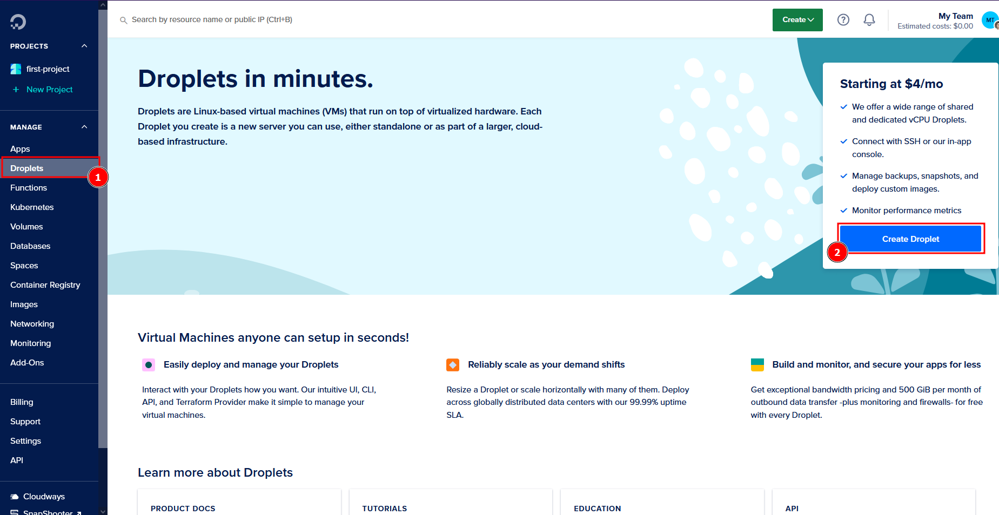
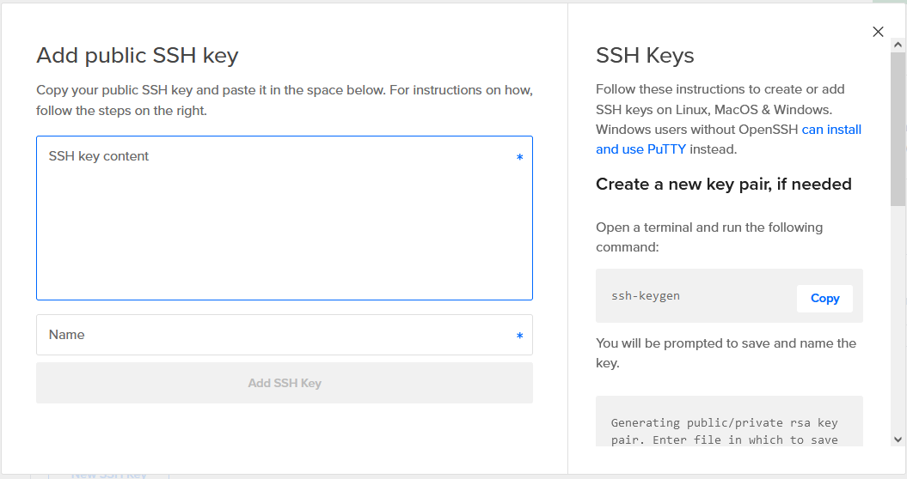
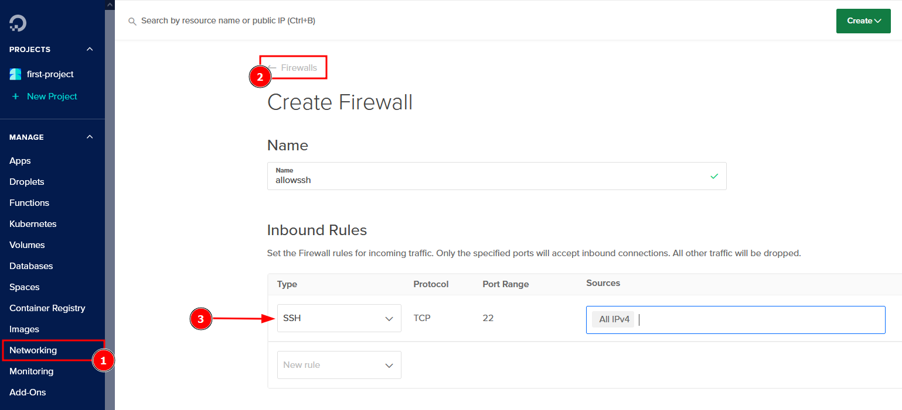
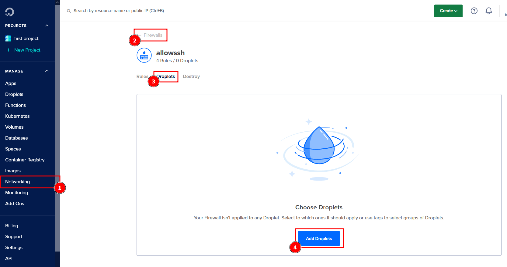
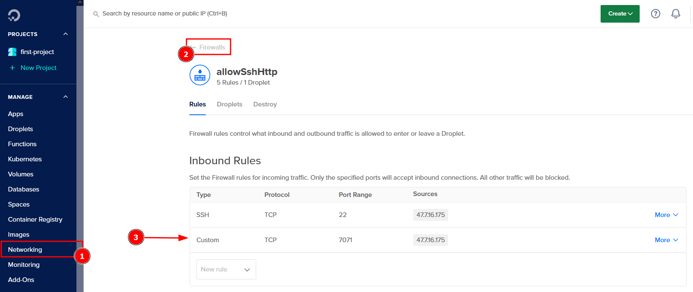

# Project: Create server and deploy application on DigitalOcean

## Technologies used:
- DigitalOcean
- Linux
- Java
- Gradle

## Project Requirements:
+ Setup and configure a server on DigitalOcean
+ Create and configure a new Linux user on the Droplet (Security best practice)
+ Deploy and run Java Gradle application on Droplet

## Implementation Steps:







```bash
$ ssh -i .ssh/digitalocean root@137.184.120.168
```

### in Droplet
```bash
~# apt update
~# apt upgrade
~# apt install openjdk-8-jre-headless
```

#### create a user
```bash
~# adduser application
~# usermod -aG sudo application
~# su - application
$ mkdir .ssh
$ sudo vim .ssh/authorized_keys
```
- copy the public ssh key into the newly created `authorized_keys` file

### Locally
```cmd
gradle build
```
```bash
scp -i /home/<user>/.ssh/digitalocean build/libs/devops-module5-project.jar root@137.184.120.168:/home/application
```

```bash
$ ssh -i .ssh/digitalocean application@137.184.120.168
```

### In Droplet
```bash
$ java -jar devops-module5-project.jar &

...
2023-10-11 20:55:35.183  INFO 26741 --- [           main] o.s.b.w.embedded.tomcat.TomcatWebServer  : Tomcat initialized with port(s): 7071 (http)
...
```


```bash
$ ps aux | grep java
$ netstat -lpnt
```

### in Droplet for Nexus
